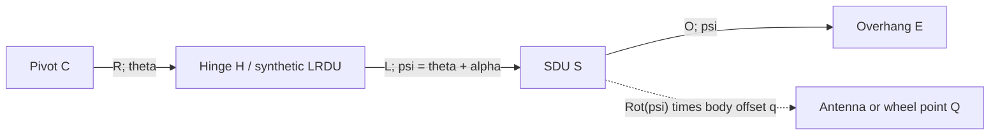

# Corner-arm geometry and layout research

Research packet for the 2026-09-27 owner request; execution continued on
2026-09-28 UTC. This is an implemented, bounded research study and development
handoff, not qualification of an installed irrigation machine.

## Decision and scope

Use a common reference-frame trajectory for future reports, mapping and layout
scoring. Verify supplied trajectories before generating new ones. Start with
single articulated corner arms across manufacturers; retain DualSpan as a
separate mechanism. Use planar projected/local XY and explicit terrain gates.
The owner selected these priorities during planning.

The research implementation lives in `tools/corner-arm-research/`, with synthetic
inputs in `fixtures/corner-arm-research/`. It does not change production app
behavior, machine catalogs, project schemas, storage, KML/KMZ or controller
exports. Python packages run in an isolated offline companion environment.
This work does not require a paid service, credential, or cloud backend.

Complexity/selected effort: xhigh, because mechanism semantics, continuous
clearance, package choices and proof boundaries interact. Subagent decision:
required. The coordinator owns synthesis, Python experiments, records and
aggregate validation; one worker owns the TypeScript harness/fixtures; a second
owns source reconciliation; independent read-only QA checks numerical and claim
boundaries. Workers have disjoint paths and do not block coordinator research.
All pre-existing dirty work belongs to the owner/prior passes. A recovery packet
outside the checkout preserves pre-edit records and the original diff.

## Existing knowledge and the actual gap

The [source and package matrix](corner-arm-research-sources.md) records source
dates, revisions, hashes, workbook reconciliation and external references.
Start with these existing resources rather than rebuilding a catalog:

| Existing resource | What it establishes | What remains missing |
| --- | --- | --- |
| [Design-guide index](design-guides/topic-index.md), especially Precision and VFlex | Curated dimensions, components, guidance and terrain topics with page references | Applicability to an actual installed revision/options and complete geometry conventions |
| [Service-manual inventory](corner-service-manuals/manual-inventory.md) | Pinned Valley, VFlex, Precision and DualSpan PDFs plus index | Qualified limits/timing and machine measurements |
| [Scaffold inventory](corner-arm-artifacts/artifact-inventory.md) | Two workbook identities, 75 normalized rows and earlier solver notes | Conflicting meanings/values and unresolved lineage; no production-ready rows |
| [CornerGPSMap/FLT lane](cornergps-flt-compatibility.md) | Source metadata, synthetic/redacted exchange parsers and advisory semantics | Proprietary path reproduction and controller compatibility |
| `packages/core/src/cornerArmCatalog.ts` | Small typed source-tagged scaffold catalog | A verified manufacturer profile or as-built record |
| `packages/geometry/src/cornerArmKinematics.ts` | Fixed-length circle/polyline intersection sampler for report preview | Stable global branch continuation, continuous sweep, actual wheel steering and timing qualification |
| `packages/geometry/src/geometry.ts` | Radial evidence-bounded reach paths used by renderer and placement | Fixed-length articulated motion; this is a different model from the report sampler |

The report sampler currently chooses a nearby intersection, measures sampled
chord speed, and checks three endpoints. Its tests retain a branch-switching,
nonclosing example. Rendering/placement use a radial approximation. A larger
reach envelope therefore cannot be promoted to a mechanically feasible path.
The research harness is deliberately isolated while these two production paths
remain unchanged.

## Input and output contract for comprehensive capability

Every future parameter needs units, a reference frame, source ID/revision,
measurement uncertainty and evidence status. A numeric catalog field alone is
not a verified measurement. Preserve conflicting values without averaging them.

| Group | Required information | Consequence when absent |
| --- | --- | --- |
| Coordinates | Project CRS, units, datum/epoch where relevant, grid-to-ground relationship, pivot position and accuracy | No qualified placement; WGS84 remains input/display |
| Main machine | Tower radii, LRDU reference, actual hinge offset, physical widths | Only the explicitly modeled centers/members can be mapped |
| Corner mechanism | Hinge-to-SDU dimensions, overhang, body frames, joints, steering axes, wheel offsets/track/wheelbase | No complete individual wheel tracks or family qualification |
| Antenna | Mounting frame and lever arm, height/tilt evidence if terrain matters | Antenna path cannot be substituted for SDU/wheel path |
| Configuration | Manufacturer/model/revision, installed options, standard/inverted, leading/trailing, direction and angle zero/sign conventions | No model-specific limits or direction assumptions |
| Guidance | Path reference point, ordered coordinates, directed progress, closure and uncertainty | No qualified inverse guidance solve; a drawn perimeter is not automatically a wheel path |
| Motion | Articulation/steering bounds and rates, ground speed, drive ratios, acceleration, stops, duty cycle and reversing behavior | Geometry may be examined; timing, steering and dynamics remain unresolved |
| Site | Boundary with holes, hard obstacles, no-spray areas, crossings and access corridors, clearance and uncertainty budgets | Site suitability remains unresolved |
| Terrain | Horizontal vs structural lengths, heights/datum, slope/terrain resolution and uncertainty | Planar model only; no vertical clearance, traction, twist or rollover qualification |
| Water | Sprinkler positions, active sequences, end-gun sectors/throw and pressure/flow evidence | No supported watered-acreage or uniformity claim |
| Validation | As-built survey and timestamped independent position, heading, articulation and steering observations | Synthetic source evidence only |

Required output inventory: main-tower centers, LRDU, actual hinge, corner-frame
pose, SDU/axle reference, each wheel-contact track, antenna, overhang/end gun,
whole-member physical sweep and an independently labeled optional wet footprint.
The synthetic harness calculates the rigid-body subset; it does not claim that
its two body-fixed offset points are a real steering linkage.

Public-interface proposal for a later production pass:

```text
qualified machine profile + site constraints + supplied/generated path request
    -> reference-frame trajectory + interval diagnostics + evidence references
    -> shared report / map / placement consumers
```

Keep geometry, steering/timing, terrain and water statuses separate. Use explicit
outcomes: `verified_within_model`, `constraint_violated`, `missing_evidence`,
`numerically_unresolved`, and `search_found_no_candidate`. None means a controller
is ready. Keep versioned profile provenance and project settings in export data
when that later integration is designed; machine-local paths remain local.

## Mathematical model and verifier

For this research fixture only, LRDU and hinge coincide, main spans are aligned,
terrain is flat, and every length is a projected horizontal metre. Let C be the
pivot, R the hinge radius, L the corner span, O the overhang, theta the unwrapped
pivot angle and alpha the signed relative articulation. Define u(a)=(cos a,sin a),
J(x,y)=(-y,x) and psi=theta+alpha:

```text
H = C + R u(theta)                   hinge / synthetic LRDU
S = H + L u(psi)                     synthetic SDU reference
E = H + (L + O) u(psi)               overhang endpoint
Pj = C + Rj u(theta)                 aligned main-tower centers
Q = S + Rot(psi) q                   body-frame wheel/antenna offset
```



`q` is a vector in the moving arm frame, not a global translation. Actual
mechanisms may require another independent body heading and hinge offsets.
Within each linear theta/alpha interval, k=dalpha/dtheta is constant:

```text
dH/dtheta = R J u(theta)
dS/dtheta = R J u(theta) + L(1+k) J u(psi)
d2S/dtheta2 = -R u(theta) - L(1+k)^2 u(psi)
```

Offsets have corresponding rotated derivatives. Derivatives at interior knots
are one-sided; piecewise linear articulation is not acceleration-smooth. Ground
velocity needs a separately supported dtheta/dt. A path tangent is undefined at
zero velocity, and wheel-heading reversal cannot be inferred by forcing a zero
angle. Extension/retraction should be derived from a declared reach or hinge
convention, never a change in physical arm length.

For a future supplied SDU path gamma(s), solve
`F(theta,s)=|gamma(s)-H(theta)|^2-L^2=0`, with directed arclength s and branch
identity. Implicit differentiation yields
`ds/dtheta = ((gamma-H) dot H') / ((gamma-H) dot gamma')` when the denominator is
nonzero. Tangencies require explicit event handling. The current research
harness accepts theta/alpha trajectories; it does **not** implement this general
inverse path-continuation solver. Its absence is a recorded development gate.

Whole main/corner members and offset points are checked against field edges,
holes and obstacles. For an interval midpoint, let d be its minimum centerline
clearance after subtracting physical half-width and requested clearance. For
half-interval angle changes deltaTheta and deltaPsi, a conservative displacement
bound is `B = R*abs(deltaTheta) + rho*abs(deltaPsi)`, where
`rho=max(L+O, norm([L,0]+antennaOffset), norm([L,0]+wheelOffset_i))` measures the
furthest modeled point from the hinge. The distance-to-set function is
1-Lipschitz; a strictly positive `d-B` beyond the numerical guard establishes
clearance within this planar interpolation model. Otherwise subdivide. A
detected collision fails; an exhausted depth/numerical budget stays unresolved.
`toleranceM` stops subdivision when the displacement bound becomes too small;
it is separate from the computed floating-point guard. Neither permits crossing
a boundary or promotes an unresolved interval to verified.

Full cycles require consistent position/articulation and derivative seams.
Partial sweeps retain their endpoints without forced closure. Clearance proof
does not establish rolling constraints, time feasibility or structural safety.

## Algorithm and package experiments

Compare a bounded deterministic theta/articulation graph with SciPy constrained
cubic-spline collocation. Both use synthetic hard geometry/articulation/slope
constraints and the dimensionless objective
`J=mean(1-cos(alpha))+0.05*mean((dalpha/dtheta)^2)` over pivot angle. This rewards
extension and smoothness; it is not an acreage or hydraulic objective.

The graph uses a declared finite grid and transition budget with deterministic
ties. No candidate means the bounded search found none, not physical
infeasibility. The spline uses two fixed initializations, declared collocation
and iteration budgets, and records convergence separately from feasibility.
Its output is resampled into a piecewise linear surrogate, with explicit
full-cycle secant matching. Only that exported surrogate is submitted to the
TypeScript verifier. Neither the original spline nor a failed optimizer is
silently accepted.

Shapely uses a separately formulated complex-plane model for sampled collision
and rigid-length checks. Analytic circle/cosine-law, fixed-length, coordinate
rotation, exact polygon area and UTM central-meridian identities supplement
cross-library agreement. Sampled Shapely agreement is not continuous proof.
The same known polygons are compared with both existing JavaScript clippers.

Retain existing application packages during research. Use Shapely/pyproj/SciPy
only in the pinned companion. Defer JSTS, RBush, OMPL and Fields2Cover integration
until a measured need exists; see the [package matrix](corner-arm-research-sources.md).
Generic vehicle planners do not supply a corner-arm mechanism automatically.

The completed two-field comparison supports keeping the deterministic graph
and shared verifier as the initial research reference. Both generators returned
accepted linear trajectories in the roomy field. In the constrained square,
the graph candidate passed, while the spline solver reported convergence but
its exported trajectory violated clearance. Retain that rejected candidate as
a regression example; improve export-aware spline constraints before expanding
its role. See the [measured comparison](evidence/corner-arm-research/README.md)
for scores, hashes and qualification limits.

## Evidence, reproduction and acceptance

Run commands and evidence are documented in the
[harness README](../tools/corner-arm-research/README.md) and
[execution record](evidence/corner-arm-research/README.md). Inputs and implementation
identities accompany generated reports. Raw proprietary documents and customer
coordinates are not copied into the synthetic corpus.

The finite corpus covers analytic geometry, rotating offsets, both directions,
full/partial seams, rigid-length violations, large coordinates, concave fields,
holes, whole-member and between-sample obstacles, invalid inputs, numerical
budget exhaustion and bounded generation. General inverse guidance, machine
steering/drive timing, terrain, nozzles and real-machine holdout traces remain
explicitly outside synthetic acceptance.

Validation gates: focused TypeScript/Python research tests; design-guide and
service-manual corpus validators; source/fixture identity checks; independent
QA; `npm run validate`; `npm run validate:skills`; `npm run context-map:check`;
`git diff --check`; and `npm audit`. Browser/device/Google Earth sessions are
unnecessary because this packet changes no visible product surface. Their
runtime and physical-field gates remain unverified.

Research completion means a reproducible finite comparison, traceable sources,
measured residuals, documented unsupported cases and a development decision.
Absent measurements may block machine qualification without blocking this
research packet. Results must not turn source checks into field acceptance.

## Prioritized implementation handoff

| Order | Owning modules | Deliverable and acceptance gate |
| --- | --- | --- |
| 1 | Core machine/profile types and geometry | Reconcile dimension meanings against a qualified single-arm installation; explicit frames, units and evidence. Preserve catalog conflicts and raw-source identities. |
| 2 | Pure TypeScript geometry | Directed supplied-path continuation with branch/tangency events, inaccessible intervals and full-cycle seam checks. Independent analytic inverse-path fixtures before UI. |
| 3 | Geometry constraint model | Real hinge/axle/wheel arrangements, steering/velocity/rate and stop/reversal behavior, plus conservative swept-clearance bounds and error budget. Physical traces qualify each family separately. |
| 4 | Geometry candidate generation | Extend bounded graph/optimization experiments using the qualified verifier. Add representative fields and independent holdout comparisons; no global-optimum claim. |
| 5 | Reports, map adapters and placement scoring | Consume one trajectory; distinguish structural and optional water geometry; preserve existing projects and keep unsupported radial approximations visibly advisory. Run aggregate and exact-build browser proof. |
| 6 | Project document/store/archive | Versioned machine evidence and reproducible input settings round-trip; explicit migration/compatibility review and native device tests if persisted contracts change. |
| 7 | Field qualification / additional mechanisms | Independent surveyed/timestamped traces, terrain and water evidence. DualSpan and multi-hinge/topology changes need separate models; controller output remains a separate project. |

No stage authorizes manufacturer certification, automatic machine operation,
proprietary binary reverse engineering, paid dependencies, or publication.
